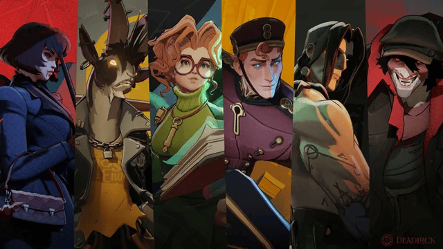
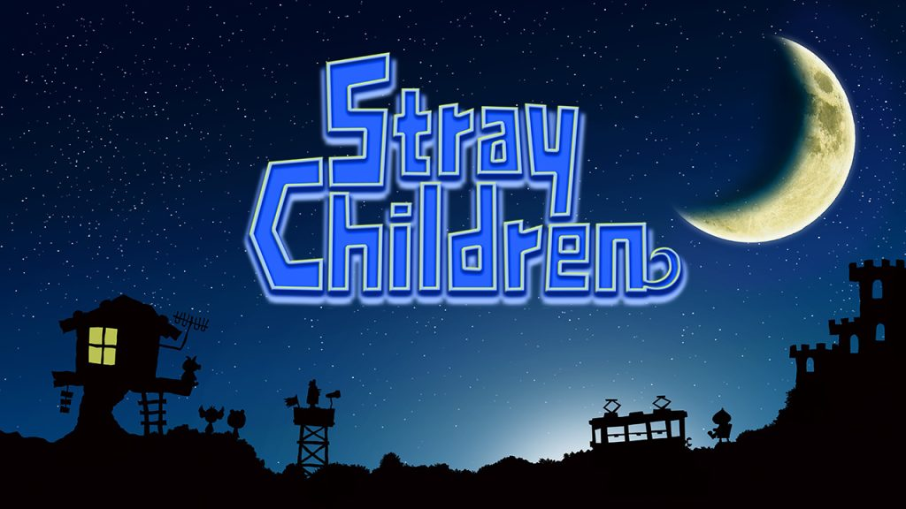

# Benjamin Turner

### About Me:
I am a 3rd-year writing major at Loyola University Maryland, currently interested in becoming an author. I love writing fiction. Video games, and movies are my primary sources of inspiration, though, rather than literature. In my free time, I love listening to music. During the fall semester of my Junior year, I partook in a writing internship with Mxdwn games, writing articles about current events in the video games industry.

### Education:
**BSc in Writing**  
Loyola University Maryland

### All of My Articles:
- During my internship with Mxdwn games this semester I had the privilage of writing 67 individual game related articles over the course of four months. Due to the sheer amount of articles, a list of all of them in chronological order can find  at my dedicated game article Instagram account.
- Full List of Articles: https://www.instagram.com/lukful.news/

### Highlighted Articles:

#### Article 1: Valve’s New MOBA Deadlock Sees Slight Resurgence in Player Base After Massive Updates
- 
- For this first article, I wrote about recent revival of Deadlock, Valve’s latest 6v6 third-person team shooter MOBA.
- Read the Article: https://games.mxdwn.com/news/valves-new-moba-deadlock-sees-slight-resurgence-in-player-base-after-massive-updates/

***
#### Article 2: Team Reptile’s HYPERFUNK Receives its First Teaser Trailer
- 
- For my next article, I wrote about a game that I personally was extremely excited to see announced. The Jet Set Radio cross Tony Hawk spiritual successor that got an announced sequel called HYPERFUNK.
- Read the Article: https://games.mxdwn.com/news/team-reptiles-hyperfunk-receives-its-first-teaser-trailer/

***
#### Article 3: A New Chao Garden is on the Horizon in Star Garden
- 
- For my third article I'd like to highlight I wrote about an exciting new indie game blending the beloved Kirby Air Ride with Sonic Adventure’s Chao garden. I covered the Kickstarter campaign for Star Garden.
- Read the Article: https://games.mxdwn.com/news/a-new-chao-garden-is-on-the-horizon-in-star-garden/

***
#### Article 4: Veteran Developer Team Behind Super Mario RPG Announce Their Newest Title, Stray Children, Releasing October 30
- 
- For my fourth article I wrote about a game from a small collective of veteran developers who worked on Super Mario RPG, Chulip, and Moon, titled Stray Children planned for release to Nintendo Switch and PC via Steam on October 30.
- Read the Article: https://games.mxdwn.com/news/veteran-developer-team-behind-super-mario-rpg-announce-their-newest-title-stray-children-releasing-october-30/
